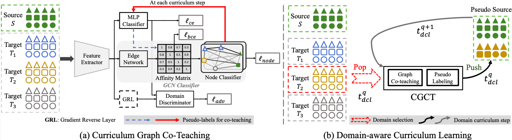
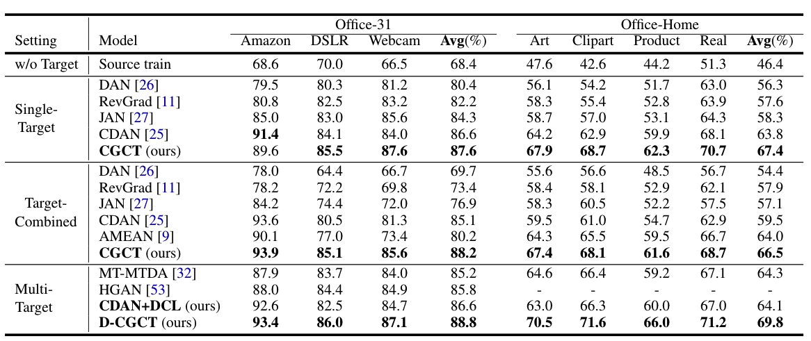

# Curriculum Graph Domain Adaptation
This repo presents PyTorch implementation of Multi-targe Graph Domain Adaptation framework from ["Curriculum Graph Co-Teaching for Multi-target Domain Adaptation" CVPR 2021](https://arxiv.org/abs/).
The framework is pivoted around two key concepts: *graph feature aggregation* and *curriculum learning* (see pipeline below or [project web-page](https://roysubhankar.github.io/graph-coteaching-adaptation/)).

# Results


# Environment
```
Python >= 3.6
PyTorch >= 1.8.1
```

# Datasets
Four datasets are supported:
* Office-31
* Office-Home
* PACS
* DomainNet

# Methods
* CDAN
* CDAN+E

# Commands
## Office-31
```
python src/main.py 
        --method 'CDAN' \
        --encoder 'ResNet50' \
 	--dataset 'office31' \
 	--data_root [your office31 folder] \
 	--source 'dslr' \
 	--target 'webcam' 'amazon' \
 	--source_iters 200 \
 	--adapt_iters 3000 \
 	--finetune_iters 15000 \
 	--lambda_node 0.3 \
 	--output_dir 'office31-dcgct/dslr_rest/CDAN'
```

## Office-Home
```
python src/main.py \
	--method 'CDAN' \
	--encoder 'ResNet50' \
	--dataset 'office-home' \
	--data_root [your OfficeHome folder] \
	--source 'art' \
	--target 'clipart' 'product' 'real' \
	--source_iters 500 \
	--adapt_iters 10000 \
	--finetune_iters 15000 \
	--lambda_node 0.3 \
	--output_dir 'officeHome-dcgct/art_rest/CDAN' 
```

## PACS
```
python src/main.py \
	--method 'CDAN' \
	--encoder 'ResNet50' \
	--dataset 'pacs' \
	--data_root [your PACS folder] \
	--source 'photo' \
	--target 'cartoon' 'art_painting' 'sketch' \
	--source_iters 200 \
	--adapt_iters 3000 \
	--finetune_iters 15000  \
	--lambda_node 0.1 \
	--output_dir 'pacs-dcgct/photo_rest/CDAN'  
```

## DomainNet
```
python src/main.py \
	--method 'CDAN' \
	--encoder 'ResNet101' \
	--dataset 'domain-net' \
	--data_root [your DomainNet folder] \
	--source 'sketch' \
	--target 'clipart' 'infograph' 'painting' 'real' 'quickdraw' \
	--source_iters 5000 \
	--adapt_iters 50000 \
	--finetune_iters 15000  \
	--lambda_node 0.1 \
	--output_dir 'domainNet-dcgct/sketch_rest/CDAN'
```
# Citation
If you find our paper and code useful for your research, please consider citing our paper.
```
@inproceedings{roy2021curriculum,
  title={Curriculum Graph Co-Teaching for Multi-target Domain Adaptation},
  author={Roy, Subhankar and Krivosheev, Evgeny and Zhong, Zhun and Sebe, Nicu and Ricci, Elisa},
  booktitle={Proceedings of the IEEE/CVF Conference on Computer Vision and Pattern Recognition},
  year={2021}
}
```